# PruebaTecnicaPromerica

Se le da solución a los distintos enunciados de la prueba técnica de Promerica para el puesto de Analista Desarrollador.

Las soluciones se encuentran en la carpeta [Enunciados](<Enunciados>). De igual forma cada solución contiene el enlace a su carpeta correspondiente.

## Tabla de contenido
- [PruebaTecnicaPromerica](#pruebatecnicapromerica)
  - [Tabla de contenido](#tabla-de-contenido)
  - [Instrucciones:](#instrucciones)
  - [Enunciados:](#enunciados)
    - [1 - Página ASPX](#1---página-aspx)
      - [Solución](#solución)
    - [2 - XML](#2---xml)
      - [Solución](#solución-1)
    - [3 - SQL](#3---sql)
      - [Solución](#solución-2)
    - [4 - API REST](#4---api-rest)
      - [Solución](#solución-3)
    - [5 - Modelo Entidad Relación](#5---modelo-entidad-relación)
      - [Solución](#solución-4)


## Instrucciones:

Realice la siguiente prueba generando los scripts / archivos que aplique para cada uno y súbalo a un repositorio GIT en cualquier servicio en la nube. El link deberá ser enviado al correo electrónico de donde recibió la prueba para poderlo descargar y revisar.

## Enunciados:
### 1 - Página ASPX
Escriba el código de una página ASPX que solicite el nombre del usuario, contraseña, y que valide que los campos no vayan vacíos antes de enviar la solicitud al servidor.
#### [Solución](<Enunciados/1>)
    Se creó un proyecto de tipo ASP.NET Web Application (.NET Framework) con el nombre de `PaginaASPX` y se selecciona la plantilla de `Web Forms` para el proyecto.

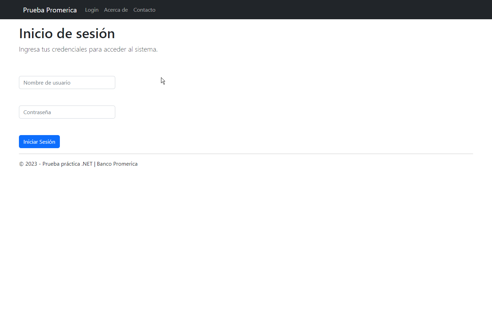

    Se crea un formulario con los campos solicitados y se agrega un botón para enviar la solicitud al servidor.

    Se agregan mensajes para el usuario en caso de que los campos estén vacíos.

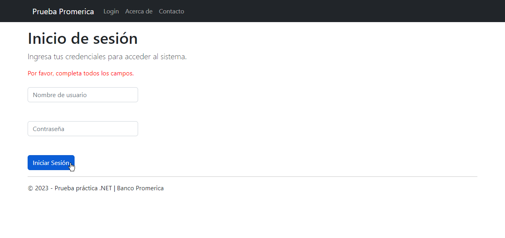

    Se agrega un mensaje de error en caso de que el usuario o la contraseña sean incorrectos.

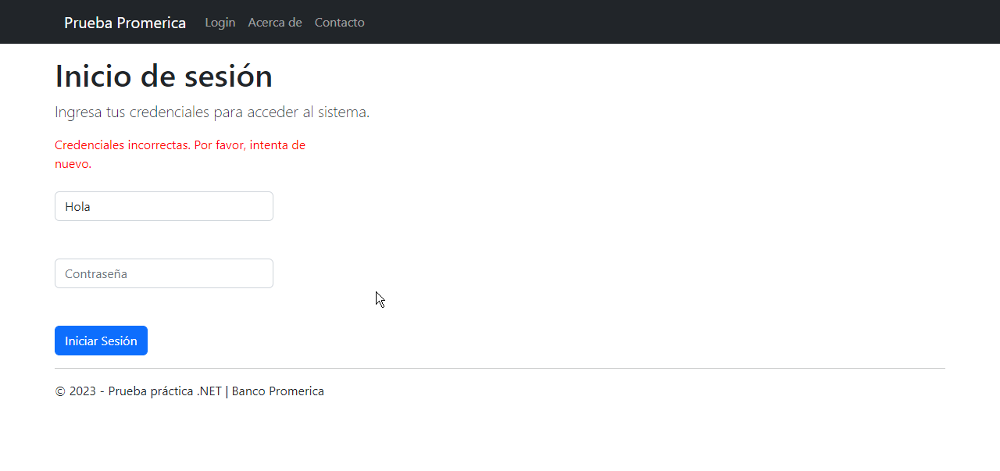

    En el caso de que las credenciales sean correctas se redirecciona a la página de contacto.
    Las credenciales correctas son:

- Usuario: `gomzalo`
- Contraseña: `Promerica2023.`

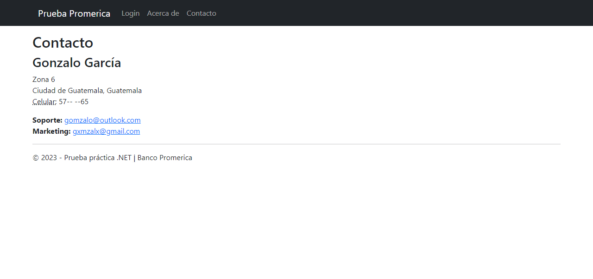

    Se agregó un archivo de estilos para darle un mejor aspecto a la página del login.

### 2 - XML
Escriba un documento XML que permita intercambiar información de tarjetas de crédito entre dos sistemas distintos: nombre del sistema, localización, número de tarjeta, ID único de cliente, etc.
#### [Solución](<Enunciados/2>)
    Se creó un archivo XML con el nombre de `TarjetaCredito.xml` con la siguiente estructura:

```xml
<?xml version="1.0" encoding="utf-8"?>
<TarjetaCredito>
  <Sistema>
    <Nombre>Nombre del sistema</Nombre>
    <Localizacion>Localización</Localizacion>
  </Sistema>
  <Tarjeta>
    <Numero>Numero de tarjeta</Numero>
    <Cliente>
      <ID>Id único de cliente</ID>
    </Cliente>
  </Tarjeta>
</TarjetaCredito>
```

### 3 - SQL
Con el siguiente modelo de base de datos:

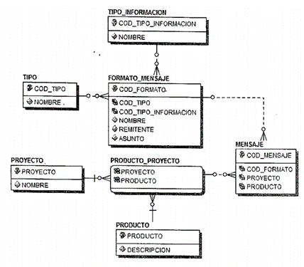

Descripción de las Tablas:

Catálogos:

- **PROYECTO**: Listado de proyectos de tarjetas que existen.
  *(Ejemplo: Premia, Konmi, Yujule, etc.)*.
- **PRODUCTO**: 
  Listado de productos de tarjetas que hay.
  *(Ejemplo Premia Clásica, Premia Oro, Premia Platinum)*.
-	**TIPO**: Tipo de mensaje.
  *(Ejemplo de mensaje de texto, mail, mensaje en el estado de cuenta)*.
-	**TIPO_INFORMACION**: Tipo del mensaje. *(Ejemplo mensaje de bienvenida, mensaje de mora, mensaje de promoción)*.

Otras:

-	**FORMATO_MENSAJE**: son los formatos de los mensajes existentes.
-	**MENSAJE**: si el mensaje aplica a que proyecto y que producto

#### [Solución](<Enunciados/3>)
    Se creo un proyecto de SQL Server con el nombre de `BDPrueba` y se creó una base de datos con el mismo nombre para probar las consultas (Se incluyen scripts DDL y DML en carpeta de solución).

  A.	Escriba la consulta en SQL que devuelva el nombre del proyecto y sus productos correspondientes del proyecto premia cuyo código es 1.

  ```sql
  SELECT
    P.NOMBRE AS NombreProyecto,
    PR.DESCRIPCION AS NombreProducto
  FROM
    PROYECTO P
  INNER JOIN PRODUCTO_PROYECTO PP
    ON P.PROYECTO = PP.PROYECTO
  INNER JOIN PRODUCTO PR
    ON PP.PRODUCTO = PR.PRODUCTO
  WHERE
    P.PROYECTO = 1;
  ```

  B.	Escriba una consulta SQL que devuelva los distintos mensajes que hay, indicando a qué proyecto y producto pertenecen.

  ```sql
  SELECT
    M.COD_MENSAJE AS CodigoMensaje,
    P.NOMBRE AS NombreProyecto,
    PR.DESCRIPCION AS NombreProducto
  FROM
    MENSAJE M
  INNER JOIN PROYECTO P
    ON M.PROYECTO = P.PROYECTO
  INNER JOIN PRODUCTO PR
    ON M.PRODUCTO = PR.PRODUCTO;
  ```

  C.	Escriba una consulta SQL que devuelva los distintos mensajes que hay, indicando a qué proyecto y producto pertenecen. Pero si el mensaje está en todos los productos de un proyecto, en lugar de mostrar cada producto, debe mostrar el nombre del proyecto y un solo producto que diga “TODOS”.

  ```sql
  SELECT DISTINCT
    P.NOMBRE AS NombreProyecto,
    CASE 
      WHEN 
        (
        SELECT
          COUNT(DISTINCT PRODUCTO)
        FROM
          MENSAJE
        WHERE
          PROYECTO = M.PROYECTO
          AND COD_FORMATO = M.COD_FORMATO
        ) = 
        (
        SELECT
          COUNT(DISTINCT PRODUCTO)
        FROM
          PRODUCTO_PROYECTO PP
        WHERE
          PP.PROYECTO = M.PROYECTO
        )
      THEN 'TODOS'
    ELSE
      PR.DESCRIPCION
    END AS NombreProducto
  FROM
    MENSAJE M
  INNER JOIN PRODUCTO_PROYECTO PP
    ON M.PROYECTO = PP.PROYECTO
    AND M.PRODUCTO = PP.PRODUCTO
  INNER JOIN PROYECTO P
    ON M.PROYECTO = P.PROYECTO
  INNER JOIN PRODUCTO PR
    ON M.PRODUCTO = PR.PRODUCTO
  GROUP BY
    P.NOMBRE,
    M.PROYECTO,
    M.COD_FORMATO,
    PR.DESCRIPCION;
  ```
  Se adjunta captura de la ejecución de las consultas.

  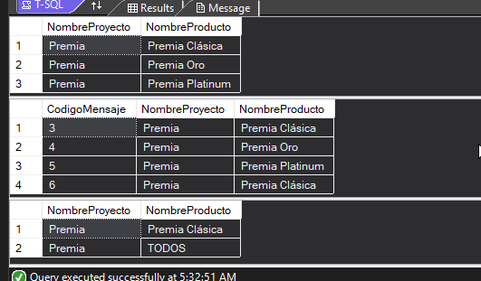

### 4 - API REST

Escriba el código de una clase, en sintaxis C# que permita hacer conexiones a una base de datos cualquiera, y que devuelva en uno de sus métodos un Dataset al hacer un SELECT, y en otro de sus métodos el número de filas afectadas al ejecutar un INSERT, UPDATE o DELETE. También debe poder devolver el número de filas que devolvería un SELECT si se ejecutara.

#### [Solución](<Enunciados/4>)
    Se creó un proyecto de tipo ASP.NET Web API (.NET CORE) con el nombre de `API_REST` y se selecciona la plantilla de `Web API` para el proyecto.
    Se creo el CRUD para la tabla `Proyecto` de la base de datos `BDPrueba` creada en el enunciado 3.

    La clase ConexionBD contiene la logica para la conexión a la base de datos y la ejecución de las consultas utilizando Microsoft.Data.SQLClient.

  ```csharp	
    using System.Data;
    using Microsoft.Data.SqlClient;

    namespace API_REST
    {
        public class ConexionBD
        {
            private readonly string _cadenaConexion;
            public ConexionBD()
            {
                _cadenaConexion = "Data Source=(localdb)...";
            }

            public DataSet EjecutarSelect(string query)
            {
                using (SqlConnection connection = new SqlConnection(_cadenaConexion))
                {
                    SqlDataAdapter adapter = new SqlDataAdapter(query, connection);
                    DataSet dataSet = new DataSet();
                    adapter.Fill(dataSet);
                    return dataSet;
                }
            }

            public int EjecutarInsertUpdateDelete(string query)
            {
                using (SqlConnection connection = new SqlConnection(_cadenaConexion))
                {
                    SqlCommand command = new SqlCommand(query, connection);
                    connection.Open();
                    int affectedRows = command.ExecuteNonQuery();
                    return affectedRows;
                }
            }

            public int ObtenerNumeroRegistros(string query)
            {
                using (SqlConnection connection = new SqlConnection(_cadenaConexion))
                {
                    SqlCommand command = new SqlCommand(query, connection);
                    connection.Open();
                    int rowCount = (int)command.ExecuteScalar();
                    return rowCount;
                }
            }
        }

    }

  ```

    Se adjuntan capturas de la API Rest en funcionamiento.

  **GET**

  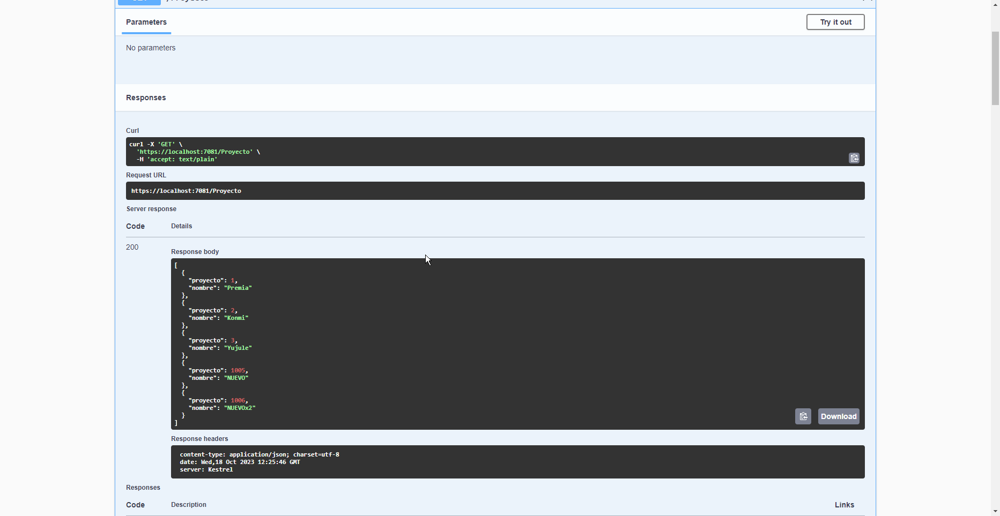

  **POST**

  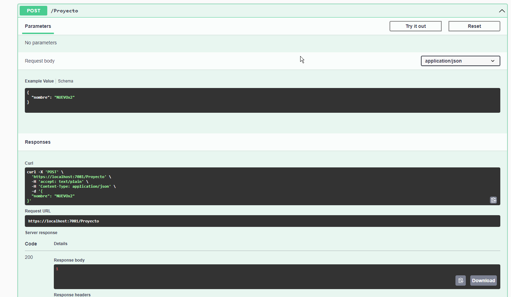

  **PUT**

  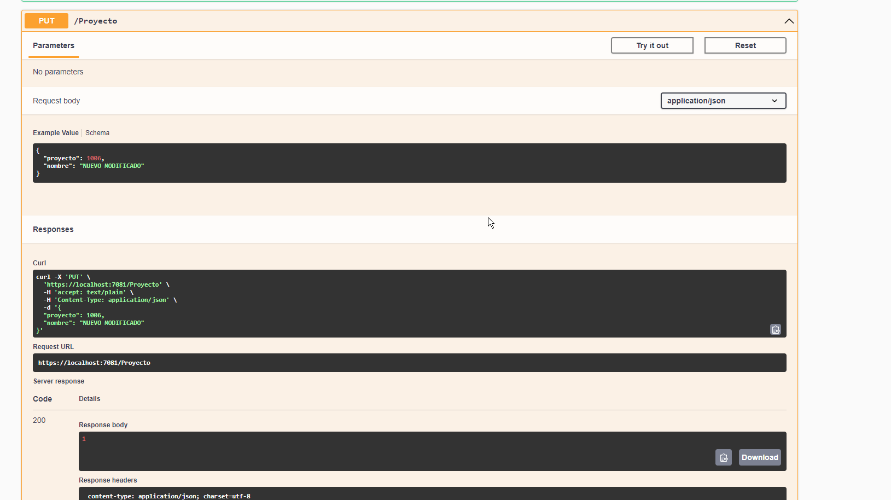

  **DELETE**

  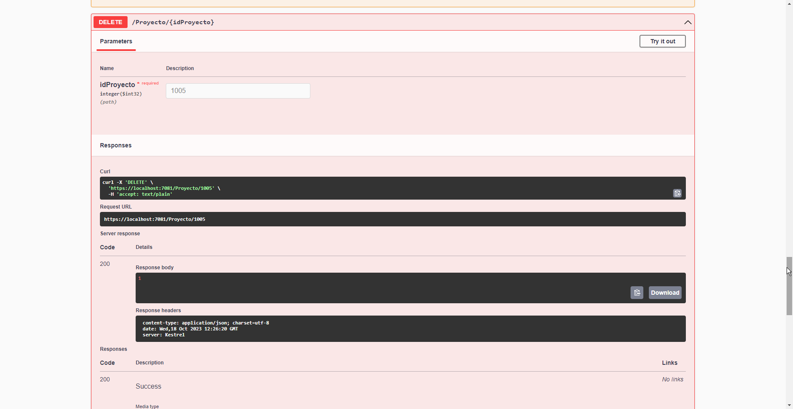

  **GET COUNT**

  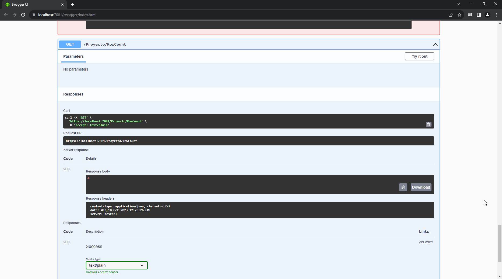


### 5 - Modelo Entidad Relación

Construya un modelo Entidad Relación que permita llevar el control de Canje de sus puntos acumulados por premios.

- a.	El artículo debe tener código, nombre, tipo y subtipo.

- b.	Se debe manejar la existencia de artículos por sucursal. Ejemplo, está la sucursal Promerica Majadas y Promerica Columbus y en cada sucursal existen artículos como DVD de Disney, lapiceros, mouse, etc. Y cada sucursal debe saber qué cantidad posee en inventario.

- c.	Van a existir varias promociones para canjear y estas van a estar compuestas por varios artículos. Estas promociones poseen rangos de fecha de vigencia y en dichas promociones estará el costo de los puntos y el precio del artículo

- d.	El canje debe tener ID del artículo, Cantidad Canjeada, Precio del artículo, la promoción y observaciones.

#### [Solución](<Enunciados/5>)